# DB-as-a-Web 🚀

> **PostgreSQL is the only Web Server you need.**
> No Nginx. No Node.js runtime. Just pure SQL and HTTP.

`DB-as-a-Web` は、PostgreSQL 内部で Web サーバーの役割（ルーティング、SSR、アセット配信）を完結させる実験的なプロジェクトです。
PostgREST を薄いゲートウェイとして利用し、データベースから直接 HTML, CSS, JS, 画像を「Raw Media Type」として配信します。

## 🏗 Architecture

このプロジェクトは「3層アーキテクチャ」を「1層（DB）」に圧縮します。

```mermaid
sequenceDiagram
    participant Client as 🌐 Browser
    participant Gateway as ⚡ PostgREST (Gateway)
    participant DB as 🐘 PostgreSQL (Kernel)

    Client->>Gateway: GET /blog/hello
    Note over Gateway: No logic here.\nJust a proxy.
    Gateway->>DB: CALL serve_raw()
    
    rect rgb(30, 30, 30)
        Note right of DB: **The God Function**
        DB->>DB: resolve_route('/blog/hello')
        DB->>DB: 1. Check Redirects
        DB->>DB: 2. Check Cache (ETag/304)
        DB->>DB: 3. SSR (Fetch Data & Bind Template)
    end
    
    DB-->>Gateway: Return Byte Stream (*/* domain)
    Gateway-->>Client: 200 OK (text/html)

```



## ✨ Features

* **Zero Middle-tier Logic**: アプリケーションロジックは全て PL/pgSQL で記述。
* **Database Native SSR**: SQL クエリの結果をその場で HTML テンプレートに埋め込み配信。
* **Smart Caching**: DB への負荷を最小限にする `ETag` / `304 Not Modified` の完全実装。
* **Asset Packing**: ローカルの `public/` ディレクトリを SQL (`INSERT`) にコンパイルしてデプロイ。
* **Least Privilege**: 専用ロール `web_authenticator` による厳格なセキュリティ制御。

## 📦 Directory Structure

```text
.
├── docker-compose.yml   # 実行環境 (Postgres + PostgREST)
├── public/              # フロントエンドソース (HTML/CSS/JS)
├── sql/
│   ├── 01_schema.sql    # DBスキーマ & God Function (resolve_route)
│   └── 02_gateway.sql   # PostgREST Gateway (serve_raw)
├── tools/
│   └── compile_assets.js # アセットをSQL化するコンパイラ
└── docker/initdb/       # コンパイルされたアセットの出力先

```

## 🚀 Quick Start

### Prerequisites

* Docker & Docker Compose
* Node.js (アセットコンパイル用)

### 1. Clone & Setup

```bash
git clone [https://github.com/your-username/db-as-a-web.git](https://github.com/your-username/db-as-a-web.git)
cd db-as-a-web
npm install  # ツールの依存関係 (mime-types) をインストール

```

### 2. Compile Assets

`public/` フォルダの中身を SQL に変換します。

```bash
node tools/compile_assets.js

```

### 3. Launch

```bash
docker-compose up --build

```

### 4. Visit

ブラウザで [http://localhost](https://www.google.com/search?q=http://localhost) にアクセスしてください。
"healthy" (または `public/index.html` の内容) が表示されれば成功です！

## 🛠 Tech Stack & Configuration

* **PostgreSQL 15**: アプリケーションの心臓部。
* **PostgREST v12**: DB 関数を HTTP に露出させるゲートウェイ。
* Configuration Key: `PGRST_RAW_MEDIA_TYPES`
* **Magic Trick**: PostgREST v12 の仕様に合わせ、カスタムドメイン `*/*` を定義して `serve_raw` の戻り値として使用することで、完全な Raw モード配信を実現しています。

## 📝 Development Workflow

1. `public/` 内のファイルを編集する。
2. `node tools/compile_assets.js` を実行してデータを更新。
3. DBに反映 (以下のいずれか):

* コンテナ再起動: `docker-compose up --build`
* ホットリロード (データのみ): `docker-compose exec -T db psql -U web_authenticator -d webdb < docker/initdb/02_assets.sql`

## ⚠️ Limitations

* これは概念実証 (PoC) です。
* 巨大なファイルの配信には適していません (PostgreSQL のメモリ制限に依存)。
* PostgREST v12 以降が必須です。
